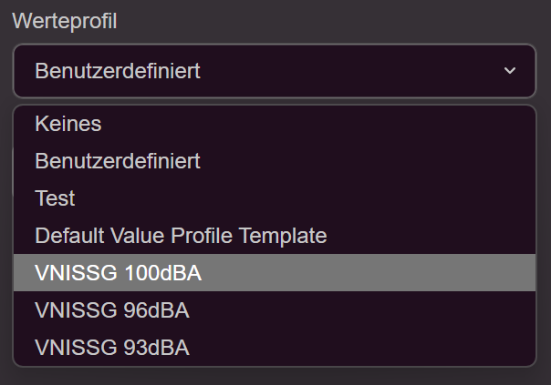
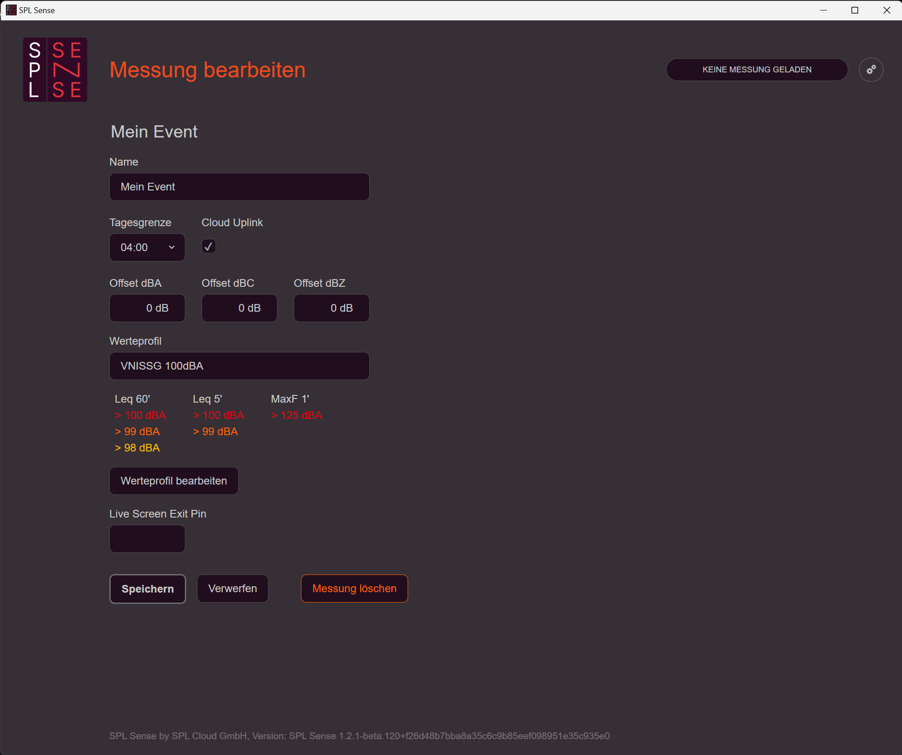

## Überblick Dashboard

•	**Logo in der linken oberen Ecke:** Klickt man auf das Logo, gelangt man zurück zum Dashboard. 
•	**Statusanzeige (rechts oben):** Zeigt den aktuellen Status an (keine Messung geladen / Messung gestoppt / Messung läuft). 
•	**Einstellungen (Zahnradsymbol rechts oben):** Öffnet die Einstellungen. 
•	**Neue Messung erstellen:** Klicken Sie auf den «+»-Knopf neben "Gespeicherte Messungen", um eine neue Messung zu erstellen. 
•	**Verbundenen Sensor anzeigen:** Auf der rechten Seite wird der verbundene Messsensor angezeigt. Ein Klick darauf zeigt den detaillierten Status des Sensors. 
## Sensor-Status / Einstellungen

Im Sensor-Detailbildschirm kannst du die Kompensation für den Wetterschutz aktivieren. Ist diese Option aktiv, wird der Wetterschutz durch einen FIR-Filter im Sensor kompensiert. 
## Verbindung zur SPL Cloud (optional)
Jedes SPL Sense kann mit der SPL Cloud verbunden werden, um Daten in Echtzeit einzusehen und zu speichern. 
1.	**Einstellungen öffnen:** Klicke auf das Zahnradsymbol oben rechts. 

2.	**Cloud auswählen:** Wähle die Option "Cloud". 

3.	**Verbindung herstellen:** Klicke auf den Link oder scanne den QR-Code. (Das SPL Sense muss mit dem Internet verbunden sein, und ein persönlicher Zugang zur SPL Cloud muss erstellt werden.)
Nach Abschluss der Schritte ist das SPL Sense mit der SPL Cloud verbunden. 

## Messung erstellen
1.	**Neue Messung erstellen:** Klicke auf den «+»-Knopf neben „Gespeicherte Messungen“. 
2.	**Name eingeben:** Gebe einen Namen für die Messung ein. Dieser Name wird später als Überschrift der Messung angezeigt. 
3.	**Tagesgrenze festlegen:** Stelle die Tagesgrenze ein. Diese kann von Mitternacht bis 06:00 Uhr am Morgen verschoben werden. So wird z. B. ein Konzert oder eine Party in einer Tagesübersicht angezeigt und nicht durch den Tageswechsel auf zwei Tage verteilt. Wir empfehlen, die Grenze etwa 2 Stunden nach dem erwarteten Ende des Events zu setzen. 
4.	**Cloud-Uplink aktivieren:** Aktiviere den Cloud-Uplink, um diese Messung in die Cloud zu übertragen. Diese Option ist nur verfügbar, wenn das SPL Sense mit der SPL Cloud verbunden ist. Wenn keine Verbindung besteht, wird dies entsprechend angezeigt. 

5.	**Werteprofil auswählen:** Wähle ein Werteprofil, das definiert, welche Werte mit welchen Filtern (A/C/Z) und welchen Integrationszeiten aufgezeichnet werden. Zudem können Grenzwerte für drei verschiedene Stufen (Benachrichtigung, Warnung, Limit) eingestellt werden. Das Ereignisprotokoll wird entsprechend diesen Stufen sortiert. Neben den vorgespeicherten Profilen, die sich an der V-NISSG orientieren, können auch eigene Profile erstellt werden. 

6.	**Messung speichern:** Speicher die Messung. 

Nach dem Speichern erscheint die Messung auf dem Dashboard. Eine Wolke neben der Messungsüberschrift zeigt an, ob die Messung in die SPL Cloud übertragen wird. 
## Messung öffnen und bearbeiten
1.	**Messung öffnen:** Klicke im Dashboard auf die gewünschte Messung, um sie zu öffnen. 

2.	**Messung aktivieren:** Aktiviere die Messung mit dem Knopf auf der rechten Seite. Beachte, dass immer nur eine Messung gleichzeitig aktiv sein kann. 

3.	**Grundeinstellungen anpassen:** Unter „Messung bearbeiten“ auf der rechten Seite können die Grundeinstellungen der Messung angepasst werden. Zusätzlich zu den bereits erwähnten Parametern können hier auch Offsets eingestellt und ein PIN für das Verlassen des Livescreens eingetragen werden. Außerdem besteht die Möglichkeit, die Messung dauerhaft mit allen Daten vom Rechner zu löschen. 

4.	**Offset einstellen:** Der Offset kann mithilfe der Funktion „Offset tune“ auf der rechten Seite festgelegt werden. Alle Messwerte, die während dieses Prozesses erfasst werden, werden nicht in die Messung gespeichert. Wir empfehlen, den Offset (die Pegeldifferenz zwischen dem lautesten Punkt und dem Standort des Sensors während der Messung) mit einem Testsignal, z. B. Pink Noise, einzustellen. Gehe dazu wie folgt vor: 

a.	**Pink Noise abspielen:** Verwende eine Lautstärke, die während des Konzerts oder der Veranstaltung zu erwarten ist. 
b.	**Maximalwert zurücksetzen:** Drücke den Knopf „Max zurücksetzen“. 
c.	**Publikumsfläche ablaufen:** Bewege dich mit dem Rechner und dem Sensor durch die Publikumsfläche. 
d.	**Sensor platzieren:** Stelle den Sensor an der vorgesehenen Messposition auf. 
e.	**Offset anpassen:** Justiere den Offsetwert so, dass der „Level inkl. Offset“ dem „Max inkl. Offset“ entspricht. 
f.	**Einstellungen speichern:** Speicher die vorgenommenen Anpassungen. 
Alternativ kann der Differenzpegel auch mit einem zusätzlichen Handmessgerät ermittelt werden. Weitere Informationen zum Thema Sensorstandort und Offset findest du unter folgendem Link: (Link hier einfügen).
  
## Messung starten
1.	**Messung starten:** Starte die Messung über die Schaltfläche auf der rechten Seite. 

2.	**Aktuelle Lautstärke anzeigen:** Die aktuelle Lautstärke wird ebenfalls auf der rechten Seite angezeigt. 
3.	**Lautstärkenverlauf verfolgen:** Eine Grafik dokumentiert den Verlauf der Lautstärke im Zeitverlauf. Wenn Du in die Grafik klickst, werden zusätzliche Details wie Spektraldaten sowie das Unterschreiten oder Überschreiten des Messbereichs angezeigt. 
4.	**Cloud-Verbindungsstatus:** Der Verbindungsstatus zur Cloud wird auf der rechten Seite angezeigt. 
5.	**Überschreitungen anzeigen:** Unter „Überschreitungen“ werden Pegelüberschreitungen gemäß den im Werteprofil definierten Gewichtungen und Integrationszeiten aufgelistet. Durch Anklicken der einzelnen Kategorien werden in der Grafik die definierten Stufengrenzwerte als gelbe, orange und rote Linien angezeigt. 
6.	**Ereignisprotokoll:** Im Feld „Ereignisse“ auf der rechten Seite werden Aktionen wie Starten und Stoppen der Messung sowie Anpassungen am Offset mit der jeweiligen Zeit aufgelistet. 
7.	**Live-Ansicht aufrufen:** Durch Klicken auf „Live Ansicht“ auf der rechten Seite wird die Liveansicht angezeigt. 

8.	**Liveansichten umschalten:** Oben rechts kannst Du zwischen verschiedenen Liveansichten umschalten. Es können auch eigene Live Ansichten erstellt werden. Die Liveansicht bietet eine übersichtliche Darstellung der gewünschten Messwerte während des Events und ist besonders hilfreich für Techniker oder DJs. 
9.	**Zurück zur Messungsübersicht:** Um zur Messübersicht zurückzukehren, klickst Du auf „Zurück zur Messung“. Wenn ein PIN für das Verlassen der Live-Ansicht unter „Messung bearbeiten“ festgelegt wurde, wird dieser nun abgefragt, um sicherzustellen, dass nur berechtigte Personen die Einstellungen in der Messung ändern können. 
