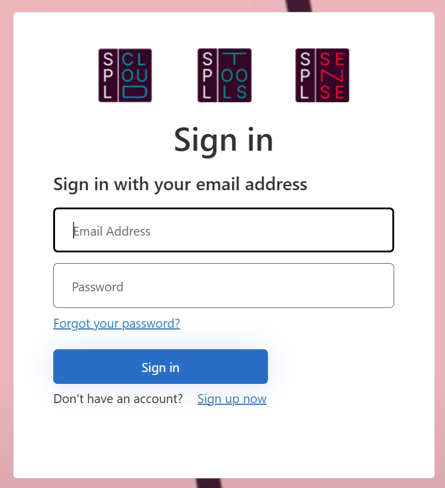

## Erste Anmeldung / Konto erstellen
1.	**Öffne im Browser:** https://spl.cloud/ 
  
2.	**Wenn du bereits ein Konto erstellt hast:** Logge dich mit deiner E-Mail und deinem Passwort ein. 
3.	**Wenn du noch kein Konto hast:** Klicke auf «Sign up now». 
  
4.	**E-Mail-Adresse eingeben:** Gib deine gültige E-Mail-Adresse ein. 
5.	**Verifizieren:** Klicke auf «Send verification code» und bestätige den Code, den du per E-Mail an deine E-Mail-Adresse erhältst. 
6.	Fülle die restlichen Felder wie Passwort, Vorname, Nachname und Anzeigename aus. 
7.	**Bestätige:** Mit «Create» die Erstellung des Kontos bestätigen. 
## Überblick Dashboard
•	**Logo in der linken oberen Ecke:** Klickt man auf das Logo, gelangt man zurück zum Dashboard. 
•	**Einstellungen (Zahnradsymbol rechts oben):** Öffnet die Einstellungen. 
•	**Neuer Messauftrag erstellen:** Klicke auf den «+»-Knopf neben "Messaufträge und Messungen", um eine neue Messauftrag zu erstellen. 
•	**Verbundene SPL Sense Instanzen anzeigen:** Auf der rechten Seite werden verbundene SPL Sense Instanzen angezeigt. 
•	**Frühere Messaufträge und Messungen:** Hier gelangst du zum Archiv deiner Messungen. 
## Einstellungen
Über das Zahnradsymbol oben rechts kommst du zu den Einstellungen. Hier kannst du Profileinstellungen anpassen und Organisationen verwalten. Eine Organisation kann deine Firma oder auch ein Event sein. Ein Gefäß, in dem Personen mit verschiedenen Rechten abgebildet werden können. 
  
## Organisation erstellen
1.	**Organisation erstellen:** Klicke auf "Organisation erstellen". 
2.	**Angaben:** Entscheide selbst, welche Angaben für dich relevant sind, und setze diese ein. 
  
Nach der Erstellung bist du automatisch als Mitglied aufgeführt. Deine Rolle ist «Besitzer». Nun können weitere Mitglieder hinzugefügt werden. Wichtig ist, dass die Personen bereits registriert sind. 
3.	**Mitglied hinzufügen:** Wähle "Mitglied hinzufügen", um weitere Personen zu erfassen. 
4.	**E-Mail-Adresse eingeben:** Gib die E-Mail-Adresse ein, mit der die Person bei SPL Cloud registriert ist. 
5.	**Benutzer bestätigen:** Wenn es die Person (E-Mail-Adresse) gibt, wird sie als «Benutzer gefunden» vorgeschlagen. Bestätige die Person mit «Auswählen». 
6.	**Rolle zuweisen:** Wähle nun, ob die Person «Mitglied» oder «Besitzer» ist. Der Unterschied ist, dass Besitzer zusätzlich die Personen der Organisation verwalten können. 
7.	**Mitglied anpassen:** Wenn du ein Mitglied deiner Organisation entfernen möchtest, wähle es aus und klicke auf «Mitglied entfernen». Ebenso kannst du die Rolle einer Person anpassen. 
## SPL Sense mit der SPL Cloud verbinden
Jedes SPL Sense kann mit der SPL Cloud verbunden werden, um Daten in Echtzeit einzusehen und zu speichern. In der Kurzanleitung von SPL Sense findest du das Vorgehen. 
1.	**Registrierung bestätigen:** Sobald du im SPL Sense den Verbindungslink angeklickt oder den QR-Code gescannt hast, musst du die Registrierung der SPL Sense Instanz bestätigen. 
  
2.	**Besitzer definieren:** Du kannst Mitglied in verschiedenen Organisationen sein. Somit kannst du auswählen, ob die Messung nur dir als Person oder einer Organisation, in der du Mitglied bist, gehören soll. 
  
3.	**SPL Sense Instanz entfernen:** Du kannst die Verbindung zur Cloud im SPL Sense lösen (siehe SPL Sense Anleitung) oder auch in deinen Organisationen die SPL Sense Instanzen verwalten. 
## Messaufträge und Messungen
Wenn du eine SPL Sense Instanz mit der SPL Cloud verbunden hast und bei diesem SPL Sense eine Messung für die Cloud freigegeben wurde, wird die Messung als «Eigenständige Messung» im Dashboard angezeigt. 
  
## Messauftrag erstellen
Du kannst mit dem «+»-Knopf neben «Messaufträge und Messungen» einen Messauftrag erstellen. Ein Messauftrag kann eine oder mehrere Messungen beinhalten und zusammenfassen. 
  
•	**Name:** Gib hier z. B. den Namen des Festivals ein. 
•	**Ort:** Hier kannst du optional den Veranstaltungsort eintragen. 
•	**Von-Bis:** Gib die Dauer des Messauftrags ein. Dieser Datumsbereich ist wichtig, damit dir der Messauftrag in den aktuellen Messungen oder im Archiv angezeigt wird. 
•	**Besitzer:** Definiere, ob der Messauftrag dir oder einer Organisation gehört, in der du Mitglied bist. 
## Messauftrag bearbeiten und Messung hinzufügen
Durch Anklicken des Stiftes neben dem Messauftrag im Dashboard kannst du die Angaben des Messauftrags anpassen. Ebenfalls kannst du dem Messauftrag Messungen zuweisen. 
  
•	**Messung zuweisen:** Unter «Messungen» «Messungen zuweisen» anklicken. Dann die gewünschte Messung auswählen. 
•	**Messung entfernen:** Wenn du eine Messung entfernen möchtest, kannst du bei der entsprechenden Messung auf «Entfernen» klicken. Nachdem du die Messungen dem Messauftrag zugewiesen hast, siehst du die Messungen auf dem Dashboard im entsprechenden Messauftrag. 
•	**Messauftrag löschen:** Du kannst mit «Messauftrag löschen» einen Messauftrag aus der Cloud entfernen. Dies ist jedoch nur möglich, wenn keine Messungen im Messauftrag vorhanden sind. 
## Übersicht Messung
Wenn du eine Messung im Dashboard anklickst, siehst du eine mit dem SPL Sense vergleichbare Übersicht. Weitere Infos dazu findest du in der Kurzanleitung vom SPL Sense. 
  
## Zugriff
Es ist möglich, anderen bei SPL Cloud registrierten Personen oder nicht registrierten Personen Zugriff auf die Messungen und Messaufträge zu geben. 
1.	**Messung öffnen:** Klicke im Dashboard eine Messung an. Auf der rechten Seite werden die aktuellen Zugriffe angezeigt. 
2.	**Zugriffsverwaltung:** Wähle das Symbol in der rechten Ecke im Feld «Zugriff», um Zugriffe zu erstellen und zu verwalten. 
  
3.	**Art des Zugriffs wählen:** Wähle «Lesezugriff hinzufügen», um bei SPL Cloud registrierten Personen einen Lesezugriff zu gewähren. Wähle «Zugriffslink hinzufügen», um Personen ohne Registrierung Zugriff zu gewähren. 
4.	**Lesezugriff hinzufügen:** Gib die E-Mail-Adresse der Person ein. Wenn sie auf SPL Cloud registriert ist, wird sie unter «Benutzer gefunden» aufgelistet und kann ausgewählt werden. 
  
5.	**Zugriffslink hinzufügen:** Gib ein Verfallsdatum für den öffentlichen Lesezugriff ein. Wir empfehlen, das Datum auf ca. 10 Tage nach dem Ende des Events zu setzen. 
  
6.	**Link oder QR-Code kopieren:** Der erstellte Link kann nun kopiert und z. B. in ein E-Mail eingefügt werden. Der QR-Code kann z. B. als Bild ausgedruckt und in einem Produktionsbüro des Festivals aufgehängt werden. Alle Personen, die Zugriff zum QR-Code oder dem Link haben, gelangen ohne Anmeldung direkt zum Messauftrag. 

